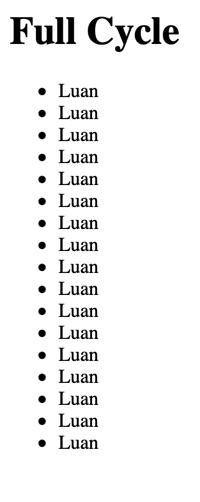

# Minimal Docker Go

The image was created just to start the studies about docker and their applications.
This is a minimal template to build a go app from the scratch with docker.

To download the generated docker image, just run the following comand:

```shell
$ docker pull lneves07/hello-world-go
```

# Reverse Proxy

This is just a minimal configuration to learn how to use nginx as a reverse proxy for a nodeJs application.<br />
<br />
To run the application, you only need to run the following command inside the project directory:
```shell
$ docker compose up -d
```

Now you can open your browser and access the port 8080, or just make a curl call:
```shell
$ curl localhost:8080
```
Now, NGINX will receive the request, parse and call the application container that is running a nodeJs application.
The nodeJS application still be running on port 3000. The NGINX container may be able to access the application container because of the shared bridge network where they are configured.<br /><br />

The application has a database connection to store some dummy data. <br />
When the user makes a GET request without parameters, it will be prompeted with a Welcome message and all the dummy data that has been saved at database, like the following:<br /><br />


